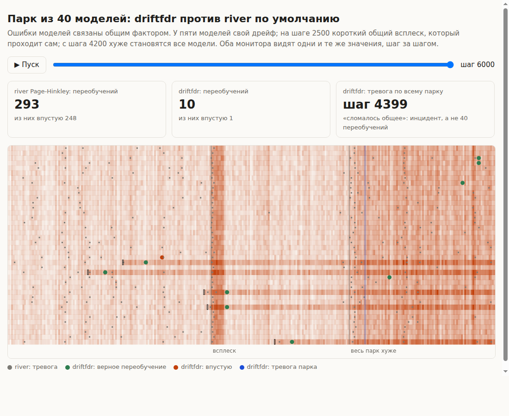

# driftfdr — мониторинг дрейфа для парка ML-моделей без лавины ложных тревог

Когда в эксплуатации десятки и сотни моделей, детекторы дрейфа (Page-Hinkley, DDM, ADWIN, KS)
на порогах по умолчанию дают поток ложных тревог и лишних переобучений: у каждого детектора
неизвестная доля ложных срабатываний, и при проверке многих моделей они складываются.
driftfdr превращает сигнал детектора в откалиброванное p-значение с учётом автокорреляции
данных и принимает решение о переобучении по всему парку моделей сразу, с заданным уровнем
ложных тревог.

```
ошибка модели 1 ─► детектор ─► бутстреп-калибровка ─► p-значение ─┐
ошибка модели 2 ─► детектор ─► бутстреп-калибровка ─► p-значение ─┼─► поправка на число моделей ─► переобучить?
ошибка модели K ─► детектор ─► бутстреп-калибровка ─► p-значение ─┘
```

## Зачем

На реальных данных — четыре открытых набора (INSECTS, Electricity, Airlines, Covertype; по 50
моделей, строки в исходном порядке) и часовые курсы пяти валютных пар — доля ложных переобучений
среди всех тревог:

| набор | Page-Hinkley river по умолчанию | driftfdr |
|---|---|---|
| INSECTS | 50% | 0% |
| Electricity | 56% | 0–8% |
| Covertype | 75% | 15% |
| Airlines | 26% | 0–6% (шаг — час) |
| Курсы валют, 40 моделей волатильности, 2010–2026 | 0 тревог, не поймано ни одно ухудшение | 0–10%, поймано 63–100% ухудшений больше 30% |

На фиксированном наборе из 100 синтетических сценариев F1 обнаружения у лучшей конфигурации
driftfdr 0.88, у Page-Hinkley river по умолчанию 0.06: он ловит все дрейфы, но 97% его тревог
ложные (эксп. 21).

Стандартный тест дрейфа Evidently на ряде ошибок тревожит в 20–78% окон, где модель не стала хуже.
Мониторинг качества NannyML сопоставим с driftfdr по точности, но его порог ±3σ фиксирован и не
зависит от числа моделей; в driftfdr уровень ложных тревог, поправка на размер парка и допустимое
ухудшение задаются явно. По скорости мониторинг не медленнее самого детектора river (около 1 мкс
на шаг на модель); калибровка занимает доли секунды на модель после каждого переобучения
(эксп. 19). Подробности и все 22 эксперимента — в
[docs/experiments.md](docs/experiments.md).

## Установка

```bash
pip install -e .                 # numpy, scipy, pandas, matplotlib
pip install -e ".[dev]"          # + pytest и river для тестов
pip install -e ".[datasets]"     # + river и scikit-learn для реальных наборов данных
```

## Быстрый старт

Монитор принимает на каждом шаге ошибку (или потерю) каждой модели и возвращает модели,
которые пора переобучать:

```python
from driftfdr import CalibrationConfig, MeanShift, StreamingMonitor

monitor = StreamingMonitor(
    model_ids=["pricing", "eta", "demand"],
    detector_factory=lambda: MeanShift(3),     # тревога, только если ухудшение держится 3 окна
    procedure="bonferroni",                    # поправка на число моделей
    alpha=0.05,                                # доля ложных тревог на окно по всему парку
    n_ref=300, window=100, horizon=5,          # в шагах; шаг может быть часом (см. bucket_means)
    calibration=CalibrationConfig(tolerance=0.05),  # переобучать, если ошибка выросла > 5 п.п.
)

for errors in stream:                          # например {"pricing": 0.21, "eta": 0.35}
    for model_id in monitor.update(errors):
        retrain(model_id)                      # монитор сам начнёт собирать новый опорный отрезок

monitor.save("monitor.npz")                    # состояние переживает перезапуск сервиса
monitor = StreamingMonitor.load("monitor.npz", detector_factory=lambda: MeanShift(3))
```

- Если ошибки моделей движутся вместе (общий источник данных, общие признаки), включите
  `split_common=True`. Тогда детекторы смотрят на отклонение каждой модели от медианы по парку,
  а сама медиана проверяется отдельно: её тревога выставляет `monitor.fleet_alarm` («сломалось
  что-то общее»). Без этого общий всплеск даёт пачку одновременных ложных тревог (эксп. 18).
  На всех четырёх реальных наборах модели сильно коррелированы, а `split_common` снимает
  большую часть этой зависимости (эксп. 20).
  В этом режиме каждая модель должна присылать значение на каждом шаге.
- Модели могут присылать данные нерегулярно или с пропусками: у каждой свои часы окон.
  Модели добавляются и убираются на лету (`add_model`, `remove_model`).
- При задержке меток передавайте ошибку модели тогда, когда пришла метка.
- Детектор можно взять из river с его настройками:
  `detector_factory=lambda: from_river(drift.PageHinkley(mode="up"))`.
- Полный пример — `examples/streaming_demo.py`. Наглядная демонстрация — `examples/live_demo.py`:
  40 связанных моделей, общий всплеск и событие во всём парке; river по умолчанию делает 293
  переобучения (248 впустую), driftfdr — 10 (1 впустую) и одну тревогу парка. Результат —
  [results/demo.html](results/demo.html), открывается в браузере с проигрыванием по шагам.



## Рекомендуемая конфигурация

| что | рекомендация | почему |
|---|---|---|
| сигнал | ошибка или потеря модели, не входные признаки | детекторы на признаках тревожат на безвредном дрейфе и не видят вредного (эксп. 11) |
| детектор | `MeanShift(1)` для скорости, `MeanShift(3)` для устойчивости; `PageHinkley` | самые мощные при сравнении на одном уровне ложных тревог (эксп. 15) |
| шаг и окно | в единицах времени, кратных циклу данных (час, сутки) | иначе суточный цикл выглядит как дрейф (эксп. 16); `bucket_means` |
| нулевая гипотеза | допуск `tolerance > 0`: «ошибка выросла существенно» | на реальных данных «ничего не изменилось» не бывает (эксп. 8, 14) |
| допуск δ | `tolerance_from_cost(цена переобучения, горизонт)` | переобучать выгодно, если рост ошибки δ за горизонт стоит больше самого переобучения |
| правило | `"bonferroni"` или `"bh_window"`; при связанных моделях — с `split_common=True` | Бонферрони держит уровень при любой корреляции моделей (эксп. 13), BH быстрее при массовых дрейфах (эксп. 4); с `split_common` лучший F1 на всём бенчмарке, выигрыш растёт с корреляцией (эксп. 18, 21) |
| не рекомендуется | ADWIN при строгих уровнях, DDM, LORD/SAFFRON, e-BH | хвост ADWIN антиконсервативен (эксп. 10); DDM слабый; онлайн-FDR медленнее при равном числе ложных (эксп. 3, 12); e-BH пропускает треть дрейфов (эксп. 13) |

## Как это работает

1. **Детектор как непрерывный скор.** У каждого детектора один параметр чувствительности, а
   бинарный сигнал — это порог на внутренней статистике. Эту статистику и берём; для
   Page-Hinkley и DDM она воспроизводит river точно.
2. **Калибровка.** Нулевое распределение статистики оценивается бутстрепом из опорного отрезка
   (данные сразу после обучения модели): AR-sieve с учётом неопределённости параметров для
   непрерывных сигналов, блочный бутстреп для ошибок 0/1, GPD-хвост для малых p-значений.
   Обычный бутстреп при автокорреляции даёт в разы больше ложных тревог, чем обещает (эксп. 1).
3. **Решение по парку.** p-значения всех моделей, у которых закончилось окно, проходят через
   поправку на множественность; модели с тревогой переобучаются и собирают новый опорный отрезок.

Подробное описание — [docs/method.md](docs/method.md); связь с литературой —
[docs/related_work.md](docs/related_work.md); справочник по всем классам, методам и
функциям — [docs/api.md](docs/api.md).

## Ограничения

- Уровень ложных тревог выдерживается для PH, KS и MeanShift; у ADWIN калибровка хвоста
  антиконсервативна примерно втрое.
- Выводы получены на синтетике и четырёх открытых наборах данных; проверки на продовых
  логах не было.
- Гарантии поправок выведены для независимых p-значений; при сильно коррелированных моделях
  надёжнее Бонферрони.
- Полный список — в [docs/experiments.md](docs/experiments.md#ограничения).

## Структура репозитория

```
src/driftfdr/
  streaming.py     StreamingMonitor, CalibratedDetector, from_river
  detectors.py     Page-Hinkley, DDM, ADWIN, KS, скользящий KS, MeanShift как непрерывные скоры
  calibration.py   нулевые распределения, p-значения, хвост, допуск δ
  bootstrap.py     блочный, стационарный и AR-sieve бутстреп
  online_fdr.py    Бонферрони, BH, BH Стори, e-BH в окне; BatchBH, LORD++, SAFFRON, LOND, alpha-investing
  preprocess.py    усреднение по временным корзинам, допуск из стоимости переобучения
  monitor.py       пакетный прогон мониторинга по готовым рядам (для экспериментов)
  metrics.py       FDR, задержки, пропуски, цена задержки
  streams.py       синтетические сценарии с известными точками дрейфа
  datasets.py      парки моделей на INSECTS, Electricity, Airlines, Covertype
experiments/       22 эксперимента (exp1…exp22)
results/           таблицы и графики экспериментов
docs/              метод, справочник API (генерируется: python docs/gen_api.py), журнал экспериментов
tests/             76 тестов: совпадение с river, бутстреп, калибровка, процедуры, потоковый режим
examples/          пример онлайн-мониторинга
```

## Тесты и воспроизведение

```bash
pytest                                         # ~10 с
python experiments/exp1_calibration.py --quick # любой эксперимент; без --quick — полный прогон
```

Эксперименты используют фиксированные сиды и закреплённые настройки, поэтому воспроизводятся;
полный прогон каждого занимает от нескольких минут до 40 минут на 4 ядрах.
