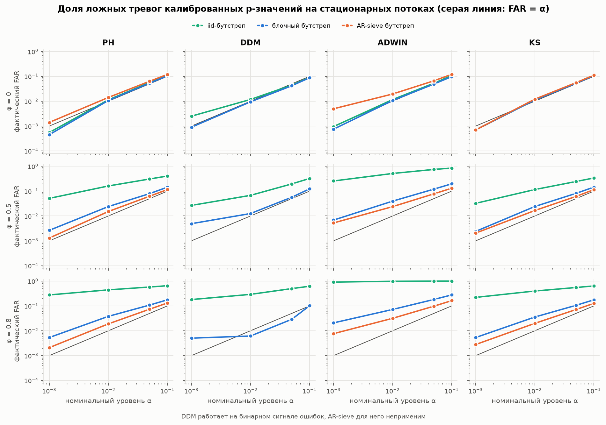
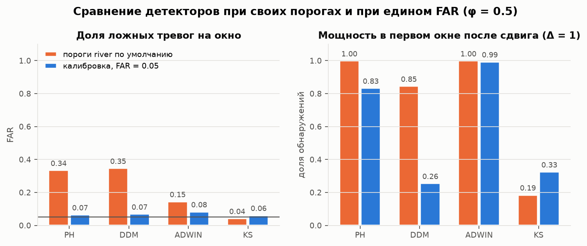
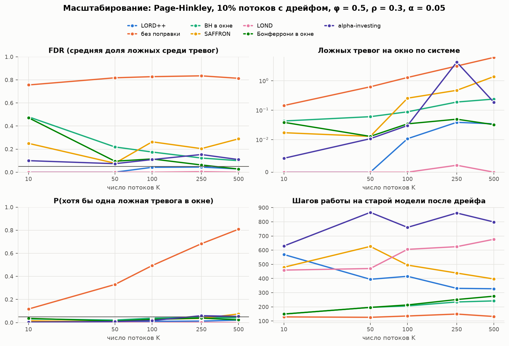
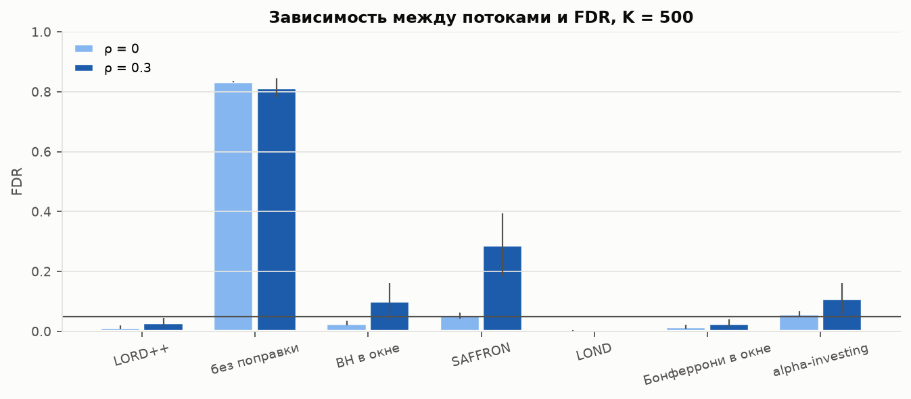
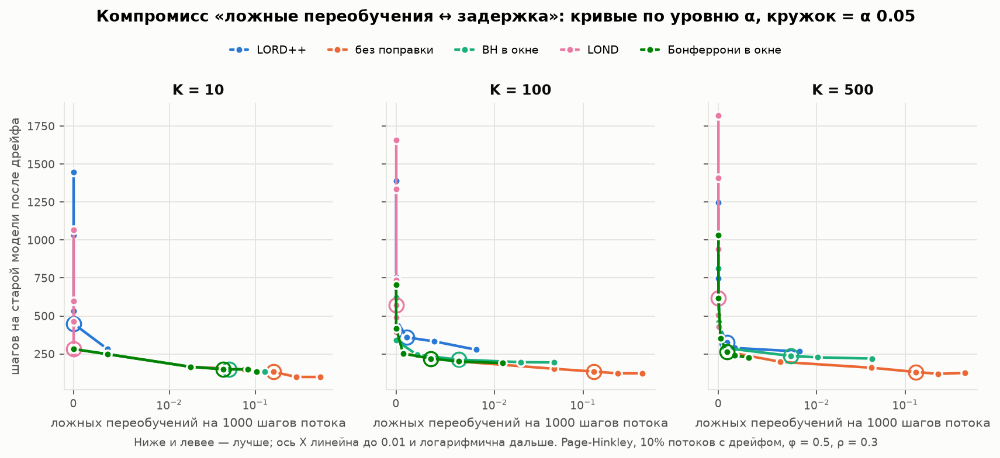
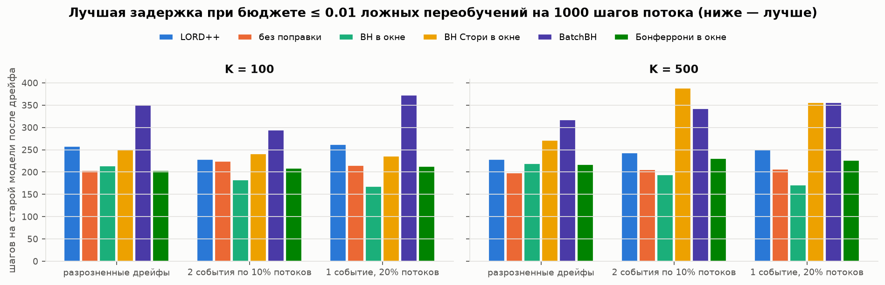
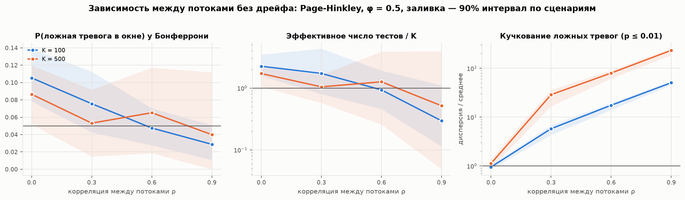
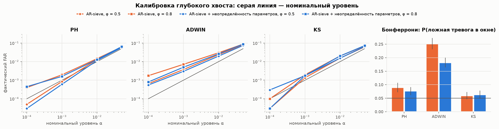
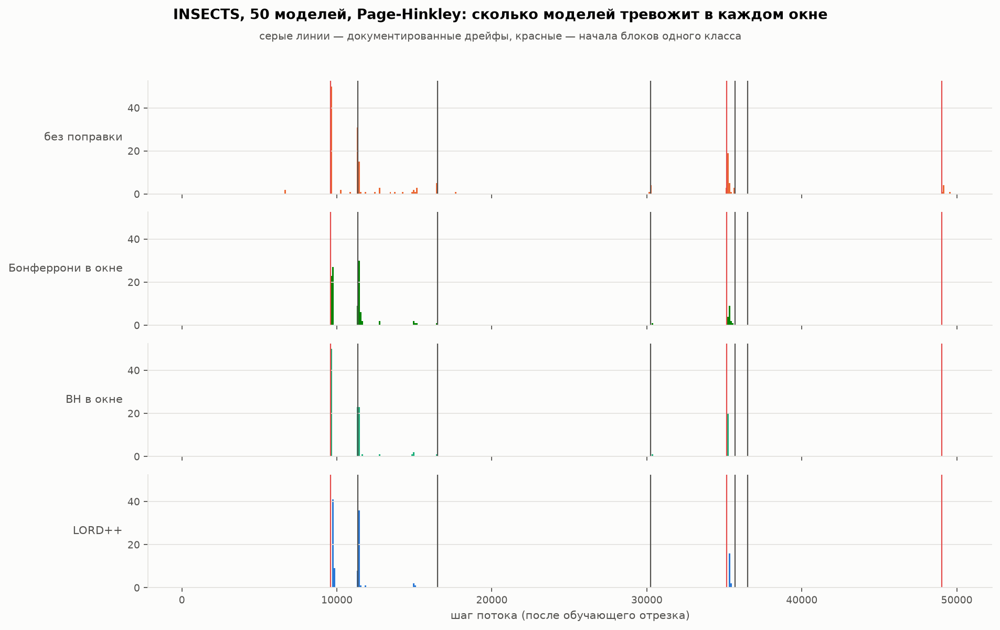
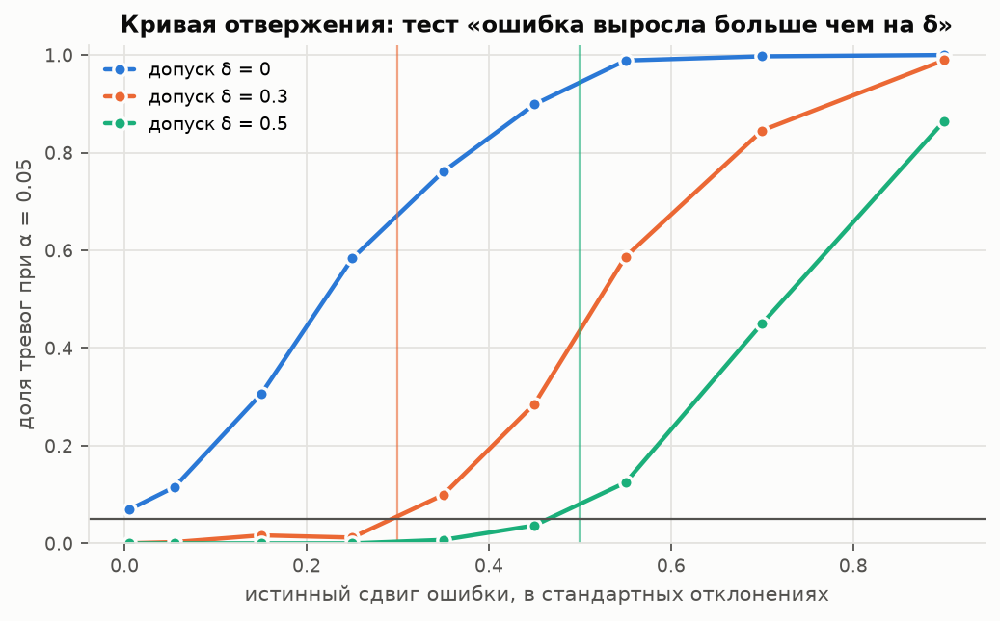

# Эксперименты

Полный журнал экспериментов, на которых основаны настройки и рекомендации библиотеки. Каждый
эксперимент запускается скриптом `experiments/expN_*.py` (в начале файла — постановка), пишет
таблицы в `results/expN_tables.md` и графики в `results/figures/`. Команды — в конце файла.

## Этап 1: калибровка и поправка на множественность

Все цифры — на синтетике: сигналы ошибок моделей как AR(1) с φ = 0.5, у 10% потоков
среднее в случайный момент сдвигается на одно стандартное отклонение, длина потока
5000 шагов, окно 100, опорный отрезок 300, горизонт 5 окон, B = 500 бутстреп-реплик.
FDR и прочие метрики усреднены по 10 независимым сценариям (эксперимент 2) или по 6
(эксперимент 3). Полные таблицы — в `results/*.md`, сырые прогоны — в `results/*.csv`.

### Эксперимент 1. Держат ли калиброванные p-значения уровень



1000 стационарных потоков × 20 окон на ячейку. Чем ближе линия к серой диагонали,
тем точнее калибровка. Без автокорреляции (φ = 0) все схемы на месте. При φ ≥ 0.5
iid-бутстреп теряет контроль полностью, блочный заметно антиконсервативен
(в 1.5–3.5 раза), AR-sieve ближе всего к номиналу. Самое трудное место — глубокий хвост:
при α = 0.001 sieve ошибается для PH и KS в 1.3–3 раза, для ADWIN в 5–8 раз. Именно
такие уровни нужны онлайн-FDR при сотнях потоков, поэтому хвост — главное узкое место
калибровки.



Половина потоков сдвигается в известный момент, φ = 0.5. На порогах river PH и ADWIN
выглядят одинаково мощными (обнаружение 1.00), но при FAR 0.34 и 0.15 соответственно.
После калибровки к единому FAR ≈ 0.05 порядок такой: ADWIN 0.99, PH 0.83, KS 0.33,
DDM 0.26. Преимущество ADWIN частично объясняется тем, что его калибровка чуть
антиконсервативна (FAR 0.084). DDM после калибровки самый слабый: доля ошибок у него
считается от начала потока и медленно реагирует на сдвиг.

### Эксперимент 2. Что происходит с ростом числа потоков



Page-Hinkley, уровень 0.05 у всех правил. Без поправки доля ложных среди тревог
стабильно около 0.8 при любом K, а вероятность хотя бы одной ложной тревоги в окне
растёт с 0.12 при K = 10 до 0.81 при K = 500. LORD++ держит FDR не выше 0.05 при всех
K. Бонферрони держит вероятность ложной тревоги в окне ниже 0.05, но его FDR при малых
K высок (0.47 при K = 10), потому что тревог там мало и одна ложная весит много. Цена
поправки — задержка: 330 шагов на старой модели у LORD++ и 275 у Бонферрони против
132 без поправки при K = 500. LOND слишком консервативен и пропускает 10% дрейфов.
У alpha-investing задержка 630–870 шагов и пропуски до 20%.
Вариант с независимыми потоками: `results/figures/exp2_scaling_rho0.png`.



Одни и те же правила при независимых (ρ = 0) и коррелированных (ρ = 0.3) потоках,
K = 500. У коррелированных потоков общий фактор и общий начальный опорный период
сдвигают p-значения всех потоков разом. Отсюда пачки ложных тревог, которые
предсказывал обзор. Процедуры, чья гарантия опирается на независимость (SAFFRON,
alpha-investing), и BH в окне теряют контроль. LORD++, LOND и Бонферрони держатся.

Точка безубыточности относительно правила без поправки на уровне 0.05 (ρ = 0.3): все
правила экономят 5–6 ложных переобучений на каждый дрейф, а платят за каждое
сэкономленное переобучение:

| K | BH в окне | Бонферрони в окне | LORD++ | LOND |
|---|---|---|---|---|
| 10 | 4 | 4 | 66 | 49 |
| 100 | 13 | 13 | 47 | 78 |
| 500 | 20 | 25 | 34 | 94 |

Числа — шаги работы на деградировавшей модели. Поправка окупается, если ложное
переобучение стоит больше этого числа шагов. Обратите внимание, что на малых K
правило без поправки само по себе не быстрое: ложная тревога ставит поток на паузу на
время сбора нового опорного отрезка, и если в эту паузу приходится дрейф, задержка
растёт.

Сравнение детекторов при K = 100: после калибровки PH даёт лучший баланс. Хвост
p-значений ADWIN антиконсервативен настолько, что даже Бонферрони даёт FDR 0.48, а
LORD++ — 0.24. KS держит FDR 0.07 у LORD++, но с Бонферрони и BH он медленнее PH
(около 295 шагов против 210). DDM с поправками почти ничего не находит. Подробности — в `results/exp2_tables.md`.

### Эксперимент 3. Граница компромисса



Для каждого правила уровень α перебирается от 1e-4 до 0.2, и получается кривая
«ложные переобучения ↔ задержка». Ниже и левее — лучше. Ключевой результат: при
одинаковом числе ложных переобучений кривая «без поправки» (фиксированный порог на
поток, опущенный до нужного уровня) лежит не выше LORD++ и BH в окне, а при K = 500
ниже. Например, при K = 500 порог без поправки с α = 1e-4 и Бонферрони с α = 0.05
(по сути одно и то же правило, α/K на поток) дают 0.00085 ложных переобучения на 1000
шагов при 265 шагах задержки. LORD++ с тем же числом ложных переобучений даёт
324 шага. При K = 100 картина та же: BH в окне с α = 0.05 и порог без поправки с
α = 0.001 дают одинаковые 0.0064 ложных переобучения на 1000 шагов, но 212 и 201
шаг задержки соответственно.

Интерпретация: в этом сценарии дрейфы редки и разнесены во времени, в каждом окне
обычно не больше одного, и адаптивности FDR не к чему подстраиваться. Выигрыш
относительно текущей практики даёт то, что калибровка вообще позволяет выставить
уровень на поток, и этот уровень масштабируется с K. Онлайн-процедуры с убывающими
уровнями (LORD++, LOND) тратят бюджет ошибки неравномерно во времени, что для
бесконечного мониторинга невыгодно.

## Что показал этап 1

1. **Бинарного сигнала недостаточно, нужен скор.** p-значение из чёрного ящика с одним
   порогом принимает два значения, и онлайн-FDR при сотнях потоков его никогда не
   отвергнет. Решение — скор «минимальной чувствительности»; для PH и DDM он
   совпадает с river точно.
2. **Свидетельство должно копиться.** Если каждое окно тестировать отдельно, LORD++,
   SAFFRON и LOND почти ничего не находят: их уровни падают с числом проверок быстрее,
   чем растёт свидетельство. Горизонт в несколько окон решает проблему, а
   каузальность скоров позволяет калибровать все длины горизонта одним бутстрепом.
3. **Узкое место калибровки — глубокий хвост.** При экспоненциальном хвосте ошибка
   его масштаба в 10% даёт ошибку p-значения в 2–6 раз на уровнях около 1e-5, а
   оценка по опорному отрезку из 300 точек шумит сильнее. Это согласуется с эффектом,
   описанным Wu & Apley; здесь нужна поправка на изменчивость оценки нуля.
4. **Зависимость между потоками — не деталь.** Общий фактор даёт пачки ложных тревог
   и ломает процедуры, опирающиеся на независимость.
5. **Двусторонняя гипотеза пока склоняется ко второму исходу.** В однородном
   сценарии с редкими дрейфами FDR-надстройка не лучше правильно масштабированного
   порога на поток. Где она может окупиться — открытый вопрос для этапа 2.

## Этап 2: когда поправка окупается, реальные данные, нулевая гипотеза

Этап 2 по заявке — сама FDR-надстройка, зависимость между потоками, политика
переобучения и граница Парето. После MVP главный открытый вопрос: где адаптивность
FDR вообще может выиграть у порога на поток, масштабированного под K. Под него
добавлены:

- **Сценарии с кластерными дрейфами** (`drift_events`, `event_fraction` в
  `ScenarioConfig`): одно событие сдвигает сразу группу потоков, как при смене
  источника данных для многих моделей.
- **BatchBH** (Zrnic et al., 2020): BH внутри окна на уровнях, которые контролируют
  FDR по всем окнам сразу.
- **BH Стори в окне** (Storey, Taylor & Siegmund, 2004): BH на уровне α/π̂₀, сам
  поднимает порог, когда дрейфует много потоков одновременно.
- **Метрика `window_fdp`** — доля ложных среди тревог в окне, усреднённая по окнам.
  Её контролируют BH в окне и BH Стори. Общая доля ложных за весь прогон (`fdp`) у
  них выше α: в симуляции с независимыми p-значениями и α = 0.1 это 0.14–0.17 при
  0.09–0.11 внутри окна. Какую из двух ошибок контролировать в мониторинге, нужно
  выбрать явно, и это отдельный пункт для статьи.

### Эксперимент 4. Окупается ли адаптивность при кластерных дрейфах

У 20% потоков меняется среднее: либо у каждого в своё время, либо двумя событиями
по 10% потоков, либо одним событием на 20%. Для каждого правила перебирается уровень
α от 1e-5 до 0.2. Правила сравниваются по лучшей задержке, которую они достигают,
не превышая бюджет ложных переобучений. PH, φ = 0.5, ρ = 0.3, 6 сценариев на ячейку.



- **При кластерных дрейфах BH в окне обгоняет лучший фиксированный порог на поток.**
  В 7 из 8 ячеек (K × сценарий × бюджет) задержка меньше на 16–22%, в одной — на 6%.
  При K = 500 и одном событии это 172 шага против 206 при бюджете 0.01 ложного
  переобучения на 1000 шагов и 216 против 271 при бюджете 0.001. Когда в окне
  дрейфует сразу много потоков, BH поднимает порог и ловит их раньше.
- **При разрозненных дрейфах выигрыша нет,** как и в эксперименте 3: 219 против
  199 при K = 500.
- **BatchBH почти везде медленнее всех, LORD++ обычно медленнее фиксированного
  порога.** Их уровни убывают с числом окон: бюджет ошибки растягивается на всю
  бесконечную историю мониторинга.
- **BH Стори в окне, как правило, хуже обычного BH.** Оценка доли нулевых гипотез по
  одному окну слишком шумная. Общая доля ложных за прогон у него 0.28–0.40 при
  α = 0.05, хотя внутри окна 0.03.

Это первое подтверждение прикладной гипотезы в её сильной форме: область, где
FDR-подход доминирует, существует, и она определяется не числом потоков, а тем,
приходят ли дрейфы кластерами. Оговорки: сетка α грубая (7 значений), 6 сценариев на
ячейку, при бюджете 0.001 и K = 100 разброс между сценариями большой. Кривые
целиком — `results/figures/exp4_clustered_curves.png`, таблицы — `results/exp4_tables.md`.

### Эксперимент 5. Сколько даёт учёт зависимости между потоками

В заявке ожидалось, что при коррелированных потоках наивные поправки становятся
чрезмерно консервативными и нужны блочные процедуры для совместного ресемплинга.
Прежде чем строить такую процедуру, измерен потолок её выигрыша. На потоках без
дрейфа при корреляции ρ от 0 до 0.9 посчитаны три вещи: вероятность ложной тревоги
в окне у Бонферрони; оракульный уровень на поток, при котором эта вероятность ровно
0.05, и соответствующее эффективное число тестов M_eff; кучкование ложных тревог.
При сильной корреляции все потоки сценария движутся вместе, поэтому эффективная
выборка — число сценариев (60 при K = 100 и 16 при K = 500). Интервалы получены
ресемплингом сценариев целиком.



- **Ложные тревоги приходят пачками, и это самый надёжный эффект.** Отношение
  дисперсии числа ложных тревог в окне к среднему — около 1 при независимых потоках,
  6–29 при ρ = 0.3 и 50–230 при ρ = 0.9. На практике это значит, что в одном окне
  может разом прийти несколько десятков ложных переобучений.
- **Даже без корреляции Бонферрони даёт 0.09–0.11 вместо 0.05.** Это не зависимость,
  а ошибка калибровки глубокого хвоста примерно в 2 раза на уровнях 1e-4…5e-4, та же,
  что в эксперименте 1.
- **С ростом корреляции Бонферрони действительно становится консервативнее**, но
  заметно — только при сильной корреляции. M_eff падает примерно до 0.3–0.5·K при
  ρ = 0.9. При ρ = 0.3 потолок выигрыша от учёта зависимости — примерно в 1.3–1.7
  раза по уровню на поток, то есть того же порядка, что и ошибка калибровки хвоста.
  Интервалы широкие, особенно при K = 500.

Вывод для плана: совместный бутстреп потоков оправдан, если в реальных данных
корреляция ошибок моделей сильная. В данных Rombouts & Wilms корреляция спроса между
районами 77%, но корреляция ошибок моделей может быть ниже, и это нужно измерить.
При умеренной корреляции сначала стоит чинить калибровку хвоста. Отдельный открытый
вопрос — как отличить пачку ложных тревог от общего фактора от настоящего
кластерного дрейфа из эксперимента 4: внешне они выглядят одинаково.

### Эксперимент 6. Можно ли починить глубокий хвост калибровки

Гипотеза: p-значения слишком малы на уровнях около α/K, потому что бутстреп считает
AR-модель, оценённую по 300 точкам опорного отрезка, точной (эффект Wu & Apley).
Новая схема `sieve_pu` в каждой бутстреп-реплике заново оценивает коэффициенты по
смоделированному опорному отрезку, так что неопределённость оценки попадает в нулевое
распределение.



- **Помогает, но только частично.** У Бонферрони при 100 независимых потоках
  вероятность ложной тревоги в окне для PH снизилась с 0.090 до 0.077, для ADWIN —
  с 0.25 до 0.18 (цель 0.05, 40 сценариев). У KS не изменилась (0.06).
- **Мощность почти не страдает:** в пределах 1–4 процентных пунктов.
- **Остаток ошибки — вероятно, форма хвоста.** Особенно у ADWIN: его статистика —
  максимум по многим точкам разреза, и её хвост тяжелее экспоненциального, который
  используется при экстраполяции. Следующие кандидаты: GPD-хвост с оценкой формы по
  большему числу реплик (B = 2000+) или двойной бутстреп только для хвоста.

`sieve_pu` оставлен как метод по умолчанию для реальных данных (эксперимент 7).

### Эксперимент 7. Реальные данные

Парк из 50 моделей (логистические регрессии на случайных подмножествах признаков,
обучены на начальном отрезке) на двух реальных наборах, строки **не перемешиваются**,
калибровка `sieve_pu`, α = 0.05, 3 повтора с разными моделями (`src/driftfdr/datasets.py`).

**INSECTS** (Souza et al., 2020). Документированные дрейфы бьют по всем моделям сразу —
естественный кластерный случай; ошибки моделей коррелируют на 0.77. В копии river
перед документированными точками идут длинные блоки одного класса, который модели не
предсказывают никогда, и ошибка там 100%. Это реальное, но неразмеченное изменение;
поэтому результаты даны для двух разметок: документированной и расширенной (плюс
начала таких блоков, найденные по одним меткам).



| PH, расширенная разметка | тревог | ложных | FDP | средняя задержка |
|---|---|---|---|---|
| пороги river | 911 | 680 | 0.75 | 1620 |
| без поправки | 165 | 26 | 0.15 | 162 |
| Бонферрони в окне | 120 | 4 | 0.03 | 218 |
| BH в окне | 123 | 2.7 | 0.02 | 166 |
| LORD++ | 117 | 1.3 | 0.01 | 244 |

- **На реальных данных метод работает.** Калиброванные p-значения плюс поправка
  снижают долю ложных тревог с 75% (river по умолчанию) и 15% (без поправки) до 1–3%.
  BH в окне при этом быстрее всех: на кластерном событии он за одно окно переобучает
  все 50 моделей, Бонферрони и LORD++ растягивают это на 2–3 окна (как в эксп. 4).
- **С документированной разметкой FDP около 0.45 у всех правил:** почти половина
  тревог попадает в неразмеченные блоки одного класса. Разметка реальных данных
  определяет выводы не меньше метода.
- **Пропусков много (MDR ≈ 0.7),** но это в основном изменения, после которых ошибка
  *падает*: PH и DDM следят только за ростом ошибки и такие изменения сознательно
  не ловят.
- На первом стабильном концепте ложных тревог почти нет (FAR 0.0007 при α = 0.05): потеря
  моделей там слегка снижается, односторонний тест её не замечает.

**Electricity** (Harries, 1999). Разметки нет, поэтому у 20% моделей после известного
момента метки перевёрнуты с вероятностью 0.5 (модель полностью теряет концепт) —
реальный дрейф p(y|X), внедрённый в реальную временную структуру.

- **Здесь метод не работает, и это важный результат.** FDP около 0.97 у всех правил,
  внедрённый дрейф ловится лишь в половине случаев. Electricity нестационарен сам по
  себе (сезонность, автокорреляция ошибок 0.84): «стабильные» модели тревожат из-за
  естественных изменений, и регионная нулевая гипотеза нарушается постоянно.
- **Длинный опорный отрезок помогает мало:** при 700 и 1400 шагах вместо 300
  (больше недельного цикла в 336 шагов) ложных тревог у Бонферрони на окно
  0.37 и 0.32 вместо 0.48, FDP всё равно 0.96.
- Это второй риск из заявки: на потоках, где распределение плывёт всё время,
  бинарное «дрейф есть / нет» не работает. Нужна либо модель сезонности в нулевой
  гипотезе, либо переход к «существенному» дрейфу (изменение ошибки больше порога).

Таблицы — `results/exp7_tables.md`.

### Эксперимент 8. Нулевая гипотеза «существенного и устойчивого ухудшения»

Эксперимент 7 показал, что на постоянно меняющихся данных вопрос «есть ли дрейф» теряет
смысл. Для решения о переобучении важно другое: стала ли модель **существенно** хуже, и
надолго ли. Отсюда две правки:

- **В тесте** H₀: «ошибка выросла не больше чем на δ». Калибровка сдвигает бутстреп-продолжение
  на δ вверх (для ошибок 0/1 — переворачивает нужную долю нулей); это наименее благоприятная
  точка нулевой гипотезы, поэтому p-значение валидно для любого меньшего роста
  (`CalibrationConfig(tolerance=δ)`).
- **В оценке** истина — сколько модель будет стоить, если её не переобучить: её ошибка на
  следующих 1000 шагах против ошибки на опорном отрезке (`datasets.error_rate_view`).
  Кратковременный всплеск, который проходит сам, переобучения не требует и считается нулём.
  Разметка дрейфов не нужна вовсе.

Попутно найдено и исправлено: опорный отрезок из одних ошибок (модель внутри блока одного
класса) давал вырожденное нулевое распределение и тревоги при *снижении* ошибки. Такие
потоки теперь считаются непроверяемыми (p = 1).



На синтетике со сдвигами от 0 до 1σ тест с допуском ведёт себя как задумано: сдвиги меньше δ
почти не дают тревог (0–1.7% при δ = 0.3 против 12–58% у обычного теста), у границы δ — около
α (0.10 при δ = 0.3, та же лёгкая антиконсервативность хвоста), дальше мощность растёт.

| Реальные данные, 50 моделей, δ = 5 п.п. ошибки | FDP без поправки | FDP Бонферрони | FDP BH в окне |
|---|---|---|---|
| INSECTS, обычный тест | 0.39 | 0.24 | 0.24 |
| INSECTS, тест с допуском | **0.013** | **0.007** | **0.007** |
| Electricity, обычный тест | 0.58 | 0.31 | 0.25 |
| Electricity, тест с допуском | 0.35 | 0.35 | 0.32 |

- **На INSECTS задача решена:** с допуском ложных переобучений почти нет даже без поправки
  на множественность — основную работу делает правильная нулевая гипотеза.
- **На Electricity доля ложных упала с 0.97 (эксперимент 7) до 0.25–0.35.** Остаток — в основном
  кратковременные всплески ошибки: PH берёт максимум скора внутри окна и реагирует на них.
  Следующий шаг — статистика, требующая устойчивости (среднее по всему горизонту вместо
  максимума в окне).
- Доля отвергнутых ненулевых тестов низкая (`power_per_test` ≈ 0.01–0.1), но это ожидаемо:
  после первой тревоги модель переобучается, и последующие окна того же ухудшения уже не
  проверяются против старого уровня.

Таблицы — `results/exp8_tables.md`.

### Эксперимент 9. Требование устойчивости

Новый детектор `MeanShift(persistence=m)`: статистика — наименьшее превышение средней
ошибки над опорным уровнем среди последних m окон; пока m окон не прошло, тревога невозможна.
Однооконный всплеск такую статистику не проходит. Калибровка та же (бутстреп с допуском δ = 5 п.п.),
50 моделей, 3 парка на датасет.

| Electricity, FDP | без поправки | Бонферрони | BH в окне |
|---|---|---|---|
| PH | 0.35 | 0.35 | 0.32 |
| MeanShift(1) — без устойчивости | 0.44 | 0.36 | 0.34 |
| MeanShift(3) | **0.12** | 0.27 | **0.00** |
| MeanShift(5) | 0.40 | **0.01** | 0.55 |

- **Устойчивость помогает, но результат шумный.** Остаток ложных тревог на Electricity — это
  эпизоды, когда весь парк ухудшается на несколько недель и потом восстанавливается сам:
  26–27 ложных тревог разом. Попадёт ли такой эпизод в прогон, зависит от того, когда модели
  переобучались, поэтому FDP прыгает между 0 и 0.55 для близких настроек. Нужны десятки парков,
  а не три.
- **На INSECTS все варианты дают 0–2% ложных;** устойчивость стоит немного мощности
  (доля отвергнутых ненулевых тестов 0.08 при m = 3 против 0.10 у PH).
- Эпизоды «весь парк хуже на время» — та же проблема, что и в эксперименте 5: пачку от общего
  фактора трудно отличить от настоящего кластерного дрейфа. Ответ на неё — вопрос горизонта:
  что считать «надолго» (здесь 1000 шагов ≈ 3 недели), решает стоимость переобучения.

Таблицы — `results/exp9_tables.md`.

### Эксперимент 10. Больше реплик и тяжёлый хвост

Два дополнительных рычага на той же проверке (100 независимых потоков, 30 сценариев,
`sieve_pu`): B = 2000 бутстреп-реплик вместо 500 и GPD-хвост с оцениваемой формой вместо
экспоненциального.

| Бонферрони, P(ложная тревога в окне), цель 0.05 | B = 500, экспонента | B = 500, GPD | B = 2000, GPD |
|---|---|---|---|
| PH | 0.081 | 0.073 | **0.056** ± 0.015 |
| KS | 0.059 | 0.049 | **0.046** ± 0.015 |
| ADWIN | 0.177 | 0.148 | 0.147 ± 0.021 |

- **Для PH и KS хвост калибровки починен:** с GPD-хвостом и 2000 репликами ошибка в
  пределах погрешности от номинала. GPD лучше экспоненты во всех 6 сравнениях.
- **ADWIN остаётся антиконсервативным примерно втрое.** Его статистика — максимум по многим
  точкам разреза, и хвост у неё тяжелее, чем умеют экстраполировать эти методы. Для строгого
  контроля ложных тревог лучше PH, KS или MeanShift.

Таблицы — `results/exp10_tables.md`.

### Эксперимент 11. Какой детектор какой дрейф видит: p(X) против p(y|X)

Сценарий с признаком, меткой и фиксированной линейной моделью (`make_supervised_scenario`).
Виртуальный дрейф сдвигает распределение признака, но модель остаётся верной; реальный меняет
наклон, и ошибка растёт; «оба» — одновременно; циклический переключает наклон каждые 1000 шагов.
300 моделей × 3 повтора, калибровка, Бонферрони в окне, α = 0.05. В таблице — доля моделей,
получивших хотя бы одну тревогу после начала дрейфа.

| детектор | без дрейфа | p(X), модель не хуже | p(y\|X) | оба | циклический |
|---|---|---|---|---|---|
| KS на признаке | 1% | **100%** | 0.6% | 100% | 0% |
| PH на признаке (двусторонний) | 0.6% | **99%** | 0% | 100% | 0% |
| PH на потере | 2% | 2% | 28% | 72% | 21% |
| MeanShift(3) на потере | 2% | 0.6% | 20% | 62% | 12% |
| DDM на ошибках 0/1 | 1% | 0% | 0% | 1% | 0% |

- **Детекторы на признаках отвечают не на тот вопрос.** Они тревожат на всех моделях с
  виртуальным дрейфом, то есть дают лишние переобучения, и не видят реального дрейфа совсем.
  Это количественный ответ на смешение двух видов дрейфа в прикладной литературе.
- **Детекторы на ошибке модели почти не реагируют на виртуальный дрейф** и ловят реальный.
  Но при 300 моделях и Бонферрони сдвиг потери на 0.25 (при сильно скошенной квадратичной потере)
  ловится лишь у 20–28% моделей: для слабого реального дрейфа поправка на множественность
  дорога.
- **Циклический дрейф ловится хуже постоянного:** половину времени модель снова права, и
  свидетельство не успевает накопиться.
- **DDM на ошибках 0/1 почти ничего не находит** — как и в экспериментах 1 и 2.

Вывод для применения: решение о переобучении стоит строить на ошибке модели, а детекторы на
признаках использовать как диагностику («что изменилось»), а не как триггер.

Таблицы — `results/exp11_tables.md`.

### Эксперимент 12. Граница компромисса по типу и силе дрейфа

Как эксперимент 3, но отдельно для резкого и постепенного (рампа 500 шагов) дрейфа на 0.5σ и
1σ; K = 100, 10% моделей с разрозненными дрейфами, ρ = 0.3, 6 сценариев. Лучшая задержка
(шагов на старой модели) в пределах бюджета ложных переобучений на 1000 шагов:

| дрейф | бюджет | без поправки / Бонферрони | BH в окне | LORD++ |
|---|---|---|---|---|
| резкий, 0.5σ | 0.001 | **1300** | 1710 | 1940 |
| резкий, 0.5σ | 0.01 | **741** | 1190 | 1940 |
| резкий, 1σ | 0.001 | **252** | 339 | 478 |
| резкий, 1σ | 0.01 | **201** | 212 | 332 |
| постепенный, 0.5σ | 0.001 | 1510 | **1460** | 1970 |
| постепенный, 0.5σ | 0.01 | **1100** | 1460 | 1970 |
| постепенный, 1σ | 0.001 | **556** | 692 | 656 |
| постепенный, 1σ | 0.01 | **441** | 462 | 612 |

- **Вывод эксперимента 3 держится для всех типов и сил дрейфа:** при разрозненных дрейфах
  лучший фиксированный порог на поток не хуже BH и всегда лучше LORD++ (при равном бюджете
  «без поправки» и «Бонферрони» — одно и то же правило α/K). Единственное исключение
  (постепенный 0.5σ, бюджет 0.001) — в пределах шума.
- **Слабый дрейф ловится в разы медленнее:** 740–2000 шагов при 0.5σ против 200–550 при 1σ;
  постепенный — медленнее резкого.
- **MTR (Bifet et al., 2013) здесь малоинформативен:** у правил с поправкой в части прогонов
  нет ни одной ложной тревоги, MTFA и MTR бесконечны. Для сравнения правил полезнее кривые
  компромисса.

Таблицы — `results/exp12_tables.md`.

### Эксперимент 13. e-BH: контроль FDR при любой зависимости

e-BH (Wang & Ramdas, 2022) контролирует FDR при любой зависимости между моделями; p-значения
переводятся в e-значения калибратором e = 0.5 / √p. K = 200, 10% моделей с дрейфом, 10 сценариев,
α = 0.05.

| ρ | Бонферрони: FDR / задержка | BH в окне: FDR / задержка | e-BH: FDR / задержка / пропуски |
|---|---|---|---|
| 0 | 0.03 / 237 | 0.07 / 221 | 0 / 1310 / 37% |
| 0.3 | 0.05 / 228 | 0.11 / 213 | 0 / 1210 / 34% |
| 0.6 | 0.05 / 223 | **0.17** / 217 | 0 / 1040 / 26% |

- **e-BH слишком осторожен для мониторинга:** ни одной ложной тревоги, но треть дрейфов
  пропущена, а задержка впятеро больше. Цена гарантии «при любой зависимости» здесь не окупается.
- **BH в окне теряет контроль общей доли ложных с ростом корреляции** (0.07 → 0.17), хотя внутри
  окна он держит свои 0.02 — те самые пачки из эксперимента 5.
- **Бонферрони в окне остаётся около 0.05 при любой корреляции** и почти той же задержке, что BH.
  Для коррелированных моделей это самый надёжный практический выбор; BH стоит брать, когда
  ожидаются кластерные дрейфы (эксперимент 4), а корреляция ошибок умеренная.

Таблицы — `results/exp13_tables.md`.

### Эксперимент 14. Четыре реальных набора

INSECTS, Electricity (только естественные изменения, без внедрённого дрейфа), Airlines и
Covertype (первые 100 тыс. строк каждого, исходный порядок), по 50 моделей, 2 парка. Истина —
существенное ухудшение: ошибка на следующих 1000 шагах выше опорной больше чем на 5 п.п.
«river» — Page-Hinkley с порогом по умолчанию на ряде ошибок 0/1. Доля ложных среди тревог:

| набор | river | PH, без поправки | PH, Бонферрони | MeanShift(3), без поправки | MeanShift(3), Бонферрони | MeanShift(3), BH |
|---|---|---|---|---|---|---|
| INSECTS | 0.50 | 0.01 | **0** | 0.01 | **0** | **0** |
| Electricity | 0.56 | 0.34 | 0.30 | 0.08 | 0.27 | **0** |
| Covertype | 0.75 | 0.50 | 0.29 | 0.24 | **0.15** | 0.21 |
| Airlines | **0.26** | 0.37 | 0.33 | 0.35 | 0.35 | 0.32 |

- **На трёх наборах из четырёх калибровка с нулевой гипотезой существенного ухудшения
  сильно снижает долю ложных переобучений:** INSECTS 50% → 0%, Electricity 56% → 0–8%,
  Covertype 75% → 15%. Лучшая комбинация почти везде — устойчивый MeanShift(3).
- **На Airlines метод не помогает.** 1000 строк там меньше суток полётов, а доля задержек
  сильно зависит от времени суток; «будущая ошибка на 1000 шагов» колеблется внутри дня, и
  нулевая гипотеза на таком горизонте задана неудачно. Для таких данных горизонт и опорный
  отрезок нужно мерить в сутках, а не в строках.
- Порог river на Airlines тревожит редко и потому выглядит лучше, но это случайность настройки,
  а не контроль ошибки.

Таблицы — `results/exp14_tables.md`.

### Эксперимент 15. Бенчмарк всех детекторов при едином FAR

Как вторая часть эксперимента 1, но со всеми детекторами пакета и калибровкой этапа 2
(`sieve_pu`, для ошибок 0/1 — блочный бутстреп). У половины из 1000 потоков (φ = 0.5) в известный
момент среднее сдвигается; каждый детектор калиброван на номинальный FAR 0.05.

| детектор | фактический FAR | 0.5σ: 1-е окно | 0.5σ: 3-е окно | 1σ: 1-е окно |
|---|---|---|---|---|
| MeanShift(1) | 0.062 | **0.82** | 0.81 | **1.00** |
| KS-sliding | 0.064 | 0.49 | 0.72 | 0.99 |
| ADWIN | 0.073 | 0.52 | 0.89 | 0.98 |
| PH | 0.062 | 0.31 | 0.90 | 0.84 |
| MeanShift(3) | **0.044** | 0.11 | **0.93** | 0.11 |
| KS | 0.059 | 0.12 | 0.59 | 0.28 |
| DDM | 0.065 | 0.09 | 0.31 | 0.24 |

- **Для сдвига среднего ошибки самый мощный детектор — простейший MeanShift(1),** сравнение
  средней в окне с опорной: 0.82 уже в первом окне при 0.5σ против 0.31 у PH и 0.52 у ADWIN.
  Популярные детекторы проигрывают ему при честном сравнении на одном уровне ложных тревог.
- **MeanShift(3) — самый консервативный (FAR 0.044) и самый мощный к третьему окну** (0.93), но по
  построению не может сработать раньше: это плата за устойчивость, которая окупилась на реальных
  данных (эксперимент 14).
- **Скользящий KS заметно лучше пакетного** в первом окне (0.49 против 0.12), но не догоняет
  MeanShift, потому что KS ловит любое изменение распределения, а не именно рост среднего.
- **DDM — самый слабый при любом сдвиге,** как и в экспериментах 1, 2 и 11.
- ADWIN мощный, но его FAR 0.073 выше номинала — та же проблема хвоста, что в эксперименте 10.

Таблицы — `results/exp15_tables.md`.

### Эксперимент 16. Время в часах, а не в строках

В эксперименте 14 метод не помог на Airlines: 1000 строк — это полтора часа полётов, а доля
задержек зависит от времени суток (0.26 утром, 0.53 вечером). Здесь ошибки каждой модели
усреднены по часам (`bucket_means`) за все 31 день; опорный отрезок — неделя (168 часов), окно —
сутки (24 часа), истина — ошибка на следующей неделе, δ = 5 п.п.; 50 моделей, 3 парка.

| детектор | без поправки | Бонферрони | BH в окне |
|---|---|---|---|
| PH | 0.15 | 0 | 0 |
| MeanShift(1) | **0** | **0** | **0** |
| MeanShift(2) | 0.06 | 0 | 0.04 |

- **Доля ложных переобучений упала с 0.31–0.37 (построчно) до 0–0.06.** Когда окно покрывает целый
  суточный цикл, цикл сокращается сам, и остаются только настоящие изменения.
- Практическое правило: опорный отрезок и окно нужно задавать в единицах времени, кратных
  естественному циклу данных (сутки, неделя), а не в числе наблюдений. `bucket_means` заодно
  решает проблему нерегулярных потоков: сколько бы событий ни пришло за час, это одна точка.
- Допуск δ можно выбирать из стоимости переобучения: `tolerance_from_cost(cost, horizon)` = цена
  переобучения / число шагов до следующего планового переобучения (переобучать выгодно, если
  рост ошибки δ за этот срок стоит больше самого переобучения).

Таблицы — `results/exp16_tables.md`.
### Эксперимент 17. Сравнение с Evidently и NannyML

Все инструменты смотрят на один и тот же ряд ошибок 0/1 каждой модели, против одного и того же
статического опорного отрезка (первые 1000 шагов после обучения, без переобучения), окнами по 100
шагов, и оцениваются одной истиной — существенным ухудшением (δ = 5 п.п.). 20 моделей, 2 парка.

- **Evidently 0.7**, `ValueDrift` на колонке ошибок: для бинарной колонки по умолчанию — Z-тест двух
  долей, дрейф при p < 0.05. Тест воспроизведён в коде (один отчёт Evidently на окно занял бы часы)
  и сверен с настоящим Evidently на 300 случайных случаях: расхождение p-значений не больше 1e-16.
- **NannyML 0.13**, `PerformanceCalculator` по точности, чанк = окно, пороги по умолчанию
  (среднее ± 3σ точности по чанкам опорного отрезка); тревога — выход ниже нижнего порога.
- **driftfdr**: MeanShift(1) с калиброванными p-значениями, с допуском δ и без, для каждой модели
  (α = 0.05) и с Бонферрони по моделям.

| набор | метод | FAR | мощность | FDP |
|---|---|---|---|---|
| Electricity | Evidently | 0.51 | 0.71 | 0.28 |
| Electricity | NannyML | 0.014 | 0.11 | 0.06 |
| Electricity | driftfdr, δ = 0.05, Бонферрони | 0.016 | 0.13 | 0.06 |
| INSECTS | Evidently | 0.20 | 0.89 | 0.07 |
| INSECTS | NannyML | 0.031 | 0.81 | 0.013 |
| INSECTS | driftfdr, δ = 0.05, без поправки | 0.021 | 0.78 | 0.010 |
| Airlines | Evidently | 0.54 | 0.64 | 0.82 |
| Airlines | NannyML | 0.006 | 0.38 | 0.08 |
| Airlines | driftfdr, δ = 0, Бонферрони | 0.006 | 0.37 | 0.08 |
| Covertype | Evidently | 0.78 | 0.77 | 0.87 |
| Covertype | NannyML | 0.004 | 0.05 | 0.47 |
| Covertype | driftfdr, δ = 0.05, Бонферрони | 0.028 | 0.34 | 0.36 |

FAR — доля тревог в окнах без существенного ухудшения, мощность — в окнах с ним.

- **Стандартный тест дрейфа Evidently на ряде ошибок почти бесполезен как триггер переобучения:**
  тревоги в 20–78% окон, где модель не ухудшилась. Тест предполагает независимые наблюдения,
  ловит любое изменение (в том числе улучшение) и не знает о допуске.
- **NannyML и driftfdr при сопоставимом уровне ложных тревог ловят ухудшения примерно одинаково.**
  Мониторинг качества в NannyML тоже калибрует порог по разбросу опорных данных, и это работает.
- **Разница в управляемости, а не в мощности.** В driftfdr уровень ложных тревог задаётся явно
  (α), учитывает число моделей и допуск δ; у NannyML порог ±3σ фиксирован и не зависит от размера
  парка — на Covertype он почти ничего не ловит (мощность 0.05), а на INSECTS допускает больше
  ложных. Выбрать точку компромисса под цену переобучения можно только в driftfdr.

Таблицы — `results/exp17_tables.md`. Запуск требует `pip install evidently nannyml`.

## Ограничения

- Большинство выводов получено на синтетике; реальных наборов четыре, размечен из них один
  (INSECTS, и то неполно), остальные оцениваются через оракул будущей ошибки.
- Модели на реальных данных не переобучаются по-настоящему: «переобучение» — это сбор нового
  опорного отрезка для той же модели.
- AR-sieve бутстреп на AR-синтетике корректно специфицирован, поэтому его точность здесь
  оптимистична.
- Хвост калибровки для ADWIN антиконсервативен примерно втрое (эксперимент 10).
- ADWIN реализован на фиксированной сетке разрезов; сжатие окна не нужно, потому что после
  тревоги детектор и так перезапускается с нового опорного отрезка.
- Гарантии онлайн-FDR и BH выведены для независимых (или PRDS) p-значений, а здесь p-значения
  зависимы и по времени (перекрывающиеся горизонты), и между моделями.
- Решения принимаются только в конце окна; потоки должны присылать по одному наблюдению за шаг
  (нерегулярные события сводятся к шагам через `bucket_means`).

## Следующие шаги

Сделано: калибровка и поправка на множественность (эксп. 1–3), кластерные дрейфы и зависимость
(4, 5, 13), калибровка хвоста (6, 10), реальные данные и нулевая гипотеза существенного ухудшения
(7–9, 14, 16), p(X) против p(y|X) и циклический дрейф (11), типы и сила дрейфа (12), бенчмарк
детекторов (15), сравнение с Evidently и NannyML (17). Открыто:

1. **Отличить пачку ложных тревог от настоящего массового дрейфа:** оба выглядят как одновременное
   ухудшение многих моделей (эксп. 5, 9).
2. **Какую ошибку контролировать:** FDR внутри окна, FDR за весь прогон или частоту ложных тревог
   во времени (эксп. 4, 13).
3. **Хвост калибровки ADWIN** (эксп. 10).
4. **Проверка на продовых логах** и реальные переобучения вместо сбора нового опорного отрезка.
5. **Связанные работы:** сопоставить нулевую гипотезу существенного ухудшения (эксп. 8) с работой
   Podkopaev & Ramdas о «вредных» сдвигах и с оценкой качества без меток в NannyML (CBPE).

## Исходный исследовательский план и статус

| Этап заявки | Сделано в MVP | Осталось |
|---|---|---|
| 4 базовых детектора | PH, DDM, ADWIN, KS; PH и DDM совпадают с river | ADWIN без сжатия окна; последовательный KS (IKS) |
| Калибровка блочным ресемплингом к единому FAR, отображение сигнал → p-значение | блочный, стационарный и AR-sieve бутстреп; хвостовая экстраполяция; проверка равномерности (эксп. 1) | поправка на изменчивость оценки нуля (Wu & Apley) |
| Синтетический стенд с известными точками сдвига | резкий и постепенный сдвиг, AR(1) + общий фактор, K до 500 | циклический дрейф; раздельно сдвиг p(X) и p(y\|X); 100 сценариев |
| Метрики MTFA, MDR, MTD, FAR | все, плюс FDR и цена задержки | R-measure |
| Онлайн-FDR: alpha-investing, LORD, SAFFRON | плюс LOND, BH, BH Стори, Бонферрони в окне и BatchBH (этап 2) | LORD с затухающей памятью, e-детекторы (Dandapanthula–Ramdas) |
| Граница Парето по числу потоков | кривые компромисса по α при K = 10, 100, 500 (эксп. 3); точка безубыточности (эксп. 2); разрозненные и кластерные дрейфы (эксп. 4) | по типу дрейфа и интенсивности |
| Зависимость между потоками, блочные процедуры | потолок выигрыша от учёта зависимости, кучкование ложных тревог, e-BH (эксп. 5, 13) | совместный бутстреп потоков |
| Сравнение с существующими инструментами | Evidently и NannyML на четырёх реальных наборах (эксп. 17) | — |
| Реальные данные: Electricity, Airlines, Covertype, INSECTS | INSECTS (реальные дрейфы, две разметки) и Electricity (внедрённый дрейф), эксп. 7 | Airlines, Covertype; нулевая гипотеза для сезонных потоков |

## Запуск экспериментов

```bash
pip install -e ".[dev,datasets]"
python experiments/exp1_calibration.py     # ~15 мин на 4 ядрах; --quick для пробы
python experiments/exp2_scaling.py         # ~7 мин
python experiments/exp3_tradeoff.py        # ~3 мин
python experiments/exp4_clustered.py       # ~9 мин
python experiments/exp5_dependence.py      # ~6 мин
python experiments/exp6_tail.py            # ~20 мин
python experiments/exp7_real.py --method sieve_pu
python experiments/exp8_material.py
python experiments/exp9_persistence.py
python experiments/exp10_tail_shape.py     # ~40 мин
python experiments/exp11_px_pyx.py
python experiments/exp12_drift_types.py
python experiments/exp13_ebh.py
python experiments/exp14_real_all.py
python experiments/exp15_benchmark.py
python experiments/exp16_time_buckets.py
python experiments/exp17_tools.py          # нужен pip install evidently nannyml
```
